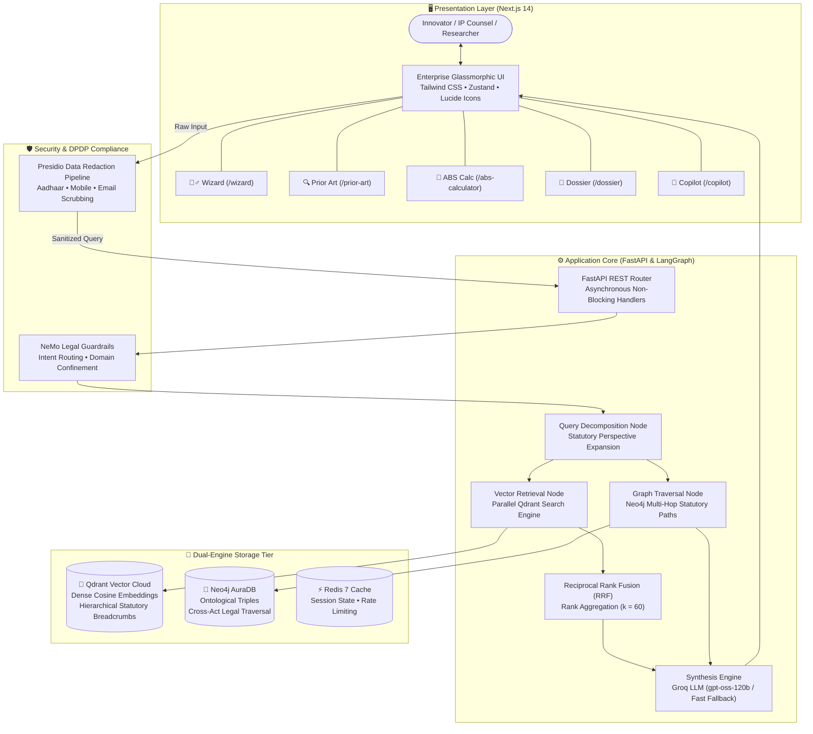

<div align="center">

# ⚖️ IP-SAKTI Sahayak
### **Enterprise AI Decision Support & Patent Intelligence Platform for Botanical, AYUSH & Indian IPR**

[](https://nextjs.org/)
[](https://fastapi.tiangolo.com/)
[](https://qdrant.tech/)
[](https://neo4j.com/)
[](https://langchain-ai.github.io/langgraph/)
[](https://python.org/)
[](LICENSE)

<br/>

> **"Can I patent this herbal formulation? What statutory approvals are mandatory from the National Biodiversity Authority? Will this application face rejection under Section 3(p) or Section 3(e) due to classical Ayurvedic texts?"**  
> **IP-SAKTI Sahayak delivers deterministic, legally cited statutory intelligence and filing-ready dossiers in seconds.**

---

</div>

## 📑 Table of Contents

0. [🚀 Production Deployment Guide (Render + Vercel)](DEPLOYMENT.md)
1. [The Big Picture: Macro Market & Problem Domain](#-the-big-picture-macro-market--problem-domain)
2. [Case Study: From Classical Formulation to Granted Phytopharmaceutical Patent](#-case-study-from-classical-formulation-to-granted-phytopharmaceutical-patent)
3. [The 5 Critical Regulatory Crises Solved](#-the-5-critical-regulatory-crises-solved)
4. [Target Stakeholders & Persona Workflows](#-target-stakeholders--persona-workflows)
5. [Production Scenarios & Concrete Use Cases](#-production-scenarios--concrete-use-cases)
   - [Scenario A: Exporting Botanical Supplements to US & EU Regimes](#scenario-a-exporting-botanical-supplements-to-us--eu-regimes)
   - [Scenario B: Overcoming a Section 3(e) Mere Admixture Objection](#scenario-b-overcoming-a-section-3e-mere-admixture-objection)
   - [Scenario C: Transparent ABS Royalty Compliance for Commercial Sourcing](#scenario-c-transparent-abs-royalty-compliance-for-commercial-sourcing)
6. [Operational Impact & Economic Metrics](#-operational-impact--economic-metrics)
7. [National Strategic Value: Defending India's Bio-Heritage](#-national-strategic-value-defending-indias-bio-heritage)
8. [Deep Dive: The 5 Core Platform Modules](#-deep-dive-the-5-core-platform-modules)
   - [1. Formulation Triage Wizard](#1-formulation-triage-wizard)
   - [2. CSIR-TKDL & Prior-Art Explorer](#2-csir-tkdl--prior-art-explorer)
   - [3. Access & Benefit Sharing (ABS) Calculator](#3-access--benefit-sharing-abs-calculator)
   - [4. Statutory Patent Dossier Generator](#4-statutory-patent-dossier-generator)
   - [5. Statutory AI Legal Copilot](#5-statutory-ai-legal-copilot)
9. [The 6 Legal Product Categories (Ayurvedic Regulatory Spectrum)](#-the-6-legal-product-categories-ayurvedic-regulatory-spectrum)
10. [Engineering Architecture & Algorithmic Foundations](#-engineering-architecture--algorithmic-foundations)
    - [RAG-Fusion & Reciprocal Rank Fusion (RRF)](#1-rag-fusion--reciprocal-rank-fusion-rrf)
    - [Dense Semantic Vector Space (Qdrant Cloud)](#2-dense-semantic-vector-space-qdrant-cloud)
    - [Ontological Multi-Hop Traversal (Neo4j Graph Engine)](#3-ontological-multi-hop-traversal-neo4j-graph-engine)
    - [Hierarchical Legal Chunking with Breadcrumbs](#4-hierarchical-legal-chunking-with-breadcrumbs)
    - [Deterministic Legal Guardrails (NeMo)](#5-deterministic-legal-guardrails-nemo)
11. [System Architecture Diagram](#-system-architecture-diagram)
12. [Data Privacy & DPDP Act (2023) Compliance](#-data-privacy--dpdp-act-2023-compliance)
13. [Step-by-Step Installation & Local Setup](#-step-by-step-installation--local-setup)
14. [Environment Configuration Reference](#-environment-configuration-reference)
15. [Asynchronous REST API Reference](#-asynchronous-rest-api-reference)
16. [Statutory & Legal Regulatory Index](#-statutory--legal-regulatory-index)
17. [License & Support](#-license--support)

---

## 🌍 The Big Picture: Macro Market & Problem Domain

India is the global epicenter of **Ayurveda, Siddha, and Unani medicine**—a traditional knowledge ecosystem spanning 5,000+ years with over **25,000 documented herbal formulations**. India's Ayush market has expanded rapidly from **$3 Billion in 2014 to over $18 Billion in 2024**, on track toward **$50 Billion by 2030**.

However, commercial innovators, biotechnology startups, pharmaceutical laboratories, and Ayurvedic researchers navigate a complex legal landscape:
- **Section 3(p) of the Patents Act, 1970** strictly prohibits patenting traditional knowledge or aggregations of known botanical properties.
- **The Biological Diversity Act (BDA, 2002 / 2023)** mandates strict penal and financial liabilities for accessing Indian biological resources without prior National Biodiversity Authority (NBA) approval.
- Regulatory authorities across **AYUSH, CDSCO, and FSSAI** enforce differing, sometimes conflicting compliance thresholds.

**IP-SAKTI Sahayak** is an **integrated legal intelligence & decision support system** engineered to resolve these challenges. It provides automated patentability triage, prior-art screening against classical texts, transparent biodiversity compliance computation, and audit-ready document generation.

---

## 🔬 Case Study: From Classical Formulation to Granted Phytopharmaceutical Patent

Consider a typical innovation pathway in the herbal biotech sector:

### The Innovation Baseline
An enterprise develops an anti-inflammatory topical emulsion combining **Shallaki** (*Boswellia serrata*), **Guggulu** (*Commiphora mukul*), and **Nirgundi** (*Vitex negundo*) utilizing a specialized enzymatic cold-extraction process. Pre-clinical evaluation indicates a 40% improvement in reduction of joint inflammation compared to single-agent controls.

### The Typical Prosecution Bottlenecks Encountered Without Automated Triage
1. **The Section 3(p) & 3(e) Patent Office Wall**: The Indian Patent Office issues a First Examination Report (FER) rejecting the application:
   > *"The application claims known anti-inflammatory herbs documented in the Ayurvedic Pharmacopoeia of India and Charaka Samhita. Under Section 3(p), traditional knowledge is non-patentable. Under Section 3(e), the claims recite a mere aggregation of known herbal properties without empirical proof of synergy."*
2. **Biodiversity Board Regulatory Notice**: The State Biodiversity Board issues an inquiry under Section 7 of the Biological Diversity Act: the enterprise commercially accessed wild *Guggulu* without prior intimation and without an approved **Access and Benefit Sharing (ABS) agreement**.
3. **Regulatory Classification Trap**: The formulation extraction ratio deviates from classical texts, preventing qualification under standard AYUSH manufacturing licenses and requiring evaluation under CDSCO Rule 122-E.

### How IP-SAKTI Sahayak Resolves the Workflow
- **Formulation Triage (30 Seconds)**: Flags that raw mixtures of the three botanicals are barred under Section 3(p), but identifies that standardizing active chemical fractions (e.g., AKBA at 90%) qualifies under **CDSCO Rule 122-E (Phytopharmaceutical Drug)** to establish patentability under Section 3(d).
- **Prior-Art Search (2 Minutes)**: Queries CSIR-TKDL and global patent databases to retrieve classical Sanskrit citations alongside modern global prior art, identifying the specific combination ratios required to establish empirical synergy under Section 3(e).
- **ABS Computation (1 Minute)**: Automatically computes statutory royalty liabilities (0.2% of ex-factory sales) and generates **NBA Form III**, ensuring full compliance with the Biological Diversity Act.
- **Statutory Dossier Generation (1 Click)**: Exports an audit-ready legal roadmap with complete statutory citations for submission to the Patent Office.

---

## ⚡ The 5 Critical Regulatory Crises Solved

### 1. The 70%+ Rejection Rate in Botanical Patent Filings
Over **70% of botanical patent applications in India are rejected or abandoned** during examination because applicants fail to differentiate between novel therapeutic fractions and public domain traditional knowledge. IP-SAKTI Sahayak evaluates claims against Section 3(p) and 3(e) prior to expensive prosecution filings.

### 2. Statutory Liabilities Under the Biological Diversity Act
Section 55 of the Biological Diversity Act enforces stringent liabilities for accessing Indian biological resources without NBA approval. Many commercial entities face operational notices simply due to lack of visibility into **Form I**, **Form III**, or **ABS agreements**. The platform automates compliance workflows.

### 3. The 40-Hour Manual Prior-Art Search Barrier
Searching across the **Traditional Knowledge Digital Library (TKDL)** and global patent databases involves millions of records across Sanskrit, Persian, Urdu, Tamil, and English. Manual legal research demands **30 to 50 billable hours per filing**. IP-SAKTI Sahayak reduces this search cycle to **under 30 seconds**.

### 4. Regulatory Overhead for MSMEs & Grassroots Innovators
India has over **10,000 Ayurvedic manufacturing enterprises**, 85% of which are micro, small, and medium enterprises (MSMEs). High IP legal fees often restrict access to quality patent counsel. IP-SAKTI Sahayak provides accessible, enterprise-grade statutory intelligence.

### 5. Foreign Biopiracy Defense & Global Compliance
Multinational filings frequently attempt to claim derivatives of Indian biological species. IP-SAKTI Sahayak assists Indian enterprises and counsel in monitoring prior art, citing classical sources, and ensuring compliance with the **Nagoya Protocol** and **WIPO GRATK Treaty (2024)**.

---

## 👥 Target Stakeholders & Persona Workflows

```
┌────────────────────────────────────────────────────────────────────────────────────────┐
│                        USER PERSONAS & PRACTICAL VALUE MATRIX                          │
├─────────────────────────┬──────────────────────────────────────────────────────────────┤
│ User Persona            │ Operational Value Delivered by Platform                      │
├─────────────────────────┼──────────────────────────────────────────────────────────────┤
│ 🌿 Ayurvedic Startups   │ • Instant patentability screening (Go / No-Go in seconds)    │
│    & Biotech Founders   │ • Identifies the appropriate regulatory regime (AYUSH/CDSCO) │
│                         │ • Generates investment-ready IP Clearance Dossiers           │
├─────────────────────────┼──────────────────────────────────────────────────────────────┤
│ 📜 Traditional Healers  │ • Protects codified herbal formulas from unauthorized theft  │
│    & Ayurvedic Vaidyas  │ • Translates classical slokas into modern patent terminology │
│                         │ • Confirms statutory exemptions under the BDA 2023 Amendment │
├─────────────────────────┼──────────────────────────────────────────────────────────────┤
│ ⚖️ Patent Attorneys     │ • Replaces 40 hours of manual CSIR-TKDL text searching       │
│    & IP Law Firms       │ • Auto-drafts counter-arguments for Section 3(p) objections  │
│                         │ • Streamlines freedom-to-operate (FTO) screening             │
├─────────────────────────┼──────────────────────────────────────────────────────────────┤
│ 🏛️ Patent Examiners     │ • Rapidly cross-checks claims against 250,000+ TKDL texts    │
│    at IPO India         │ • Accelerates First Examination Report (FER) drafting        │
│                         │ • Reduces national patent backlog and pendency timelines     │
├─────────────────────────┼──────────────────────────────────────────────────────────────┤
│ 🌳 Biodiversity Boards  │ • Automates Access & Benefit Sharing (ABS) fee calculations  │
│    (NBA & State SBBs)   │ • Tracks commercial herb access transparency                 │
│                         │ • Audits benefit-sharing flow to local tribal committees     │
├─────────────────────────┼──────────────────────────────────────────────────────────────┤
│ 🎓 University Scholars  │ • Screens academic herbal research for patentable novelty    │
│    & CSIR / ICMR Labs   │ • Evaluates Freedom-to-Operate prior to clinical validation  │
│                         │ • Identifies unpatented therapeutic opportunities            │
└─────────────────────────┴──────────────────────────────────────────────────────────────┘
```

---

## 💼 Production Scenarios & Concrete Use Cases

### Scenario A: Exporting Botanical Supplements to US & EU Regimes
- **Context**: A Pune nutraceutical enterprise manufactures *Ashwagandha* (*Withania somnifera*) formulations for export to the United States and the European Union.
- **Regulatory Complexities**: Classification boundaries between dietary supplements and herbal medicinal products, cross-border ABS compliance under the Nagoya Protocol, and US FDA / EMA botanical guidelines.
- **Platform Execution**:
  1. The **Formulation Wizard** categorizes the product under **FSSAI (Ayurveda-Aahar)** guidelines.
  2. Advises that while the raw botanical recipe is unpatentable, novel delivery mechanisms or specialized extraction techniques qualify for PCT process claims.
  3. The **ABS Calculator** flags mandatory **NBA Form I** clearance required for commercial export of Indian biological resources.
  4. The **Copilot** indexes the **Nagoya Protocol on Genetic Resources**, verifying EU import compliance.

### Scenario B: Overcoming a Section 3(e) Mere Admixture Objection
- **Context**: An enterprise receives a patent objection on a combined *Curcumin* and *Piperine* formulation under **Section 3(e)** (mere admixture of known ingredients).
- **Platform Execution**:
  1. Examiner's First Examination Report (FER) parameters are evaluated via the **Copilot**.
  2. The engine cites statutory guidelines and judicial precedents outlining quantitative synergy thresholds (e.g., Combination Index $CI < 1.0$ via Chou-Talalay models).
  3. The **Prior Art Explorer** identifies disclosures in classical TKDL texts, establishing the baseline to differentiate raw mixture from the standardized bioactive fraction.
  4. The **Dossier Generator** prepares structured legal arguments for inclusion in the formal response.

### Scenario C: Transparent ABS Royalty Compliance for Commercial Sourcing
- **Context**: An enterprise procures 10,000 kg of wild *Guggulu* resin for commercial manufacturing, with projected annual product sales of ₹5 Crores.
- **Platform Execution**:
  1. Compliance officer inputs commercial variables into the **ABS Calculator**.
  2. The statutory engine computes mandatory ABS liability: **0.5% of ex-factory gross sales** (₹2,50,000/year), or alternatively **3.0% of raw material purchase value**.
  3. Generates the required **State Biodiversity Board (SBB) Intimation Notice** and **NBA Form III** filing draft.

---

## 📈 Operational Impact & Economic Metrics

```
┌──────────────────────────────────────┬────────────────────────┬────────────────────────┐
│ Operational Metric                   │ Traditional Manual Way │ With IP-SAKTI Sahayak  │
├──────────────────────────────────────┼────────────────────────┼────────────────────────┤
│ ⏱️ Comprehensive Prior-Art Search    │ 30 to 45 billable hrs  │ Under 30 seconds       │
├──────────────────────────────────────┼────────────────────────┼────────────────────────┤
│ 💰 Pre-Filing Statutory Due Diligence│ ₹50,000 to ₹2,50,000   │ Real-time automated    │
├──────────────────────────────────────┼────────────────────────┼────────────────────────┤
│ 🛑 Risk of BDA Section 55 Penalties  │ High (Omission risk)   │ Eliminated (Flagged)   │
├──────────────────────────────────────┼────────────────────────┼────────────────────────┤
│ 📉 Section 3(p) Rejection Exposure   │ Over 70% in botanicals │ Mitigated pre-filing   │
├──────────────────────────────────────┼────────────────────────┼────────────────────────┤
│ 📄 Statutory Dossier Assembly Time   │ 2 to 3 weeks           │ Instant 1-Click Export │
├──────────────────────────────────────┼────────────────────────┼────────────────────────┤
│ 🌐 Multilingual Accessibility        │ English-only legalese  │ Bilingual via Bhashini │
└──────────────────────────────────────┴────────────────────────┴────────────────────────┘
```

---

## 🇮🇳 National Strategic Value: Defending India's Bio-Heritage

IP-SAKTI Sahayak functions as core digital infrastructure for sovereign intellectual property management:

1. **Digital Rigor for Traditional Knowledge**: Systematizes traditional formulations, making classical knowledge defensible under modern global patent frameworks (PCT, WIPO, EPO, USPTO).
2. **Promoting High-Value Botanical IP**: Encourages transitioning from low-margin raw herbal mixtures to standardized, high-value **Phytopharmaceuticals (Rule 122-E)**.
3. **Equitable Benefit Sharing**: Ensures transparent statutory accounting under the Biological Diversity Act, supporting fair revenue flow to forest-dwelling tribal communities and local Biodiversity Management Committees (BMCs).

---

## 🚀 Deep Dive: The 5 Core Platform Modules

### 1. Formulation Triage Wizard (`/wizard`)
An automated statutory triage engine evaluating multi-herb inputs:
- **Statutory Assessment Questions**:
  1. *Is the formula derived directly from an authoritative textbook listed in the First Schedule of the Drugs & Cosmetics Act?*
  2. *Has the processing method or ratio been modified, or combined with synthetic excipients?*
  3. *Is the product intended as a therapeutic drug, cosmetic, or dietary food supplement?*
  4. *Has a standardized active chemical fraction been isolated (e.g., standardized withanolides or curcuminoids)?*
- **Generated Outputs**:
  - **Regulatory Classification**: (e.g., Classical Generic, Patent-or-Proprietary, Phytopharmaceutical Drug).
  - **Patentability Posture**: Systematic breakdown against Sections 3(p), 3(d), and 3(e).
  - **Licensing Authority Routing**: Specifies whether jurisdiction falls under State AYUSH Licensing Authorities, CDSCO (DCGI), or FSSAI.

---

### 2. CSIR-TKDL & Prior-Art Explorer (`/prior-art`)
- **Botanical Taxonomic Normalization**: Resolves vernacular names (*Ashwagandha*, *Tulsi*, *Haridra*) to validated Latin botanical nomenclature (*Withania somnifera*, *Ocimum sanctum*, *Curcuma longa*).
- **Dual-Corpus Scan**:
  - Searches the **Traditional Knowledge Digital Library (TKDL)** for classical references in Ayurveda, Unani, and Siddha.
  - Queries published patent databases from the **Indian Patent Office (IPO)** and **WIPO**.
- **Novelty Risk Scorer**:
  - 🟢 **Low Risk**: Standardized novel extract or non-obvious therapeutic application.
  - 🟡 **Medium Risk**: Similar formulations exist; requires quantitative synergy data to clear Section 3(e).
  - 🔴 **High Risk**: Direct match with First Schedule classical texts; barred under Section 3(p).

---

### 3. Access & Benefit Sharing (ABS) Calculator (`/abs-calculator`)
- **Statutory Foundation**: Implements Section 6, Section 7, and Section 21 of the Biological Diversity Act, 2002 (and 2023 Amendment).
- **Input Parameters**:
  - Entity legal status: *Indian Enterprise* vs. *Foreign-Controlled / Non-Resident Entity (Section 3(2))*.
  - Projected / Actual Ex-Factory Annual Gross Sales Turnover.
  - Procurement value of raw herbal biological resources.
- **Computed Outputs**:
  - **Slab-Based Statutory Percentage**:
    - Turnover up to ₹1 Crore: **0.1%** of ex-factory gross sales.
    - Turnover ₹1 Crore to ₹3 Crores: **0.2%**.
    - Turnover exceeding ₹3 Crores: **0.5%** (or 3.0%–5.0% of raw material purchase value).
  - **Statutory Form Routing**:
    - **NBA Form I**: Commercial access by foreign entities.
    - **NBA Form III**: Mandatory pre-filing clearance for patent applications based on Indian biological resources.
    - **SBB Intimation**: Commercial sourcing by Indian companies.

---

### 4. Statutory Patent Dossier Generator (`/dossier`)
Compiles all analysis sessions into an exportable, audit-ready **Statutory Patent Dossier**:
- **Executive Summary**: Product nomenclature, botanical ingredients, therapeutic indications.
- **Patentability Opinion**: Section-wise analysis under Sections 2(1)(j), 3(p), 3(d), and 3(e).
- **Prior Art Matrix**: Tabular comparison against retrieved TKDL records and prior patents.
- **Biodiversity Compliance Certificate**: Computed ABS royalties, applicable forms, and intimation checklists.
- **Filing Checklist**: Official IPO forms schedule (Form 1, Form 2, Form 3, Form 5, Form 18) with official fee estimates.
- **Export Options**: Formatted Markdown and printable PDF.

---

### 5. Statutory AI Legal Copilot (`/copilot`)
- **Jurisdiction Toggle**: Switches context between Indian Law (Patents Act 1970, BDA 2023, Drugs & Cosmetics Rules) and International Law (PCT, WIPO GRATK Treaty, Nagoya Protocol).
- **Verbatim Statutory Grounding**: Answers are grounded in indexed statutory chunks; speculative statements without statutory citations are restricted.
- **Interactive Badging**: Citations link directly to verbatim statutory text.
- **Multilingual Support**: Voice and text interface integrated with Bhashini for Devanagari Hindi and regional languages.

---

## 🌿 The 6 Legal Product Categories (Ayurvedic Regulatory Spectrum)

```
┌────────────────────────────────────────────────────────────────────────────────────────┐
│                        AYURVEDIC FORMULATION LEGAL SPECTRUM                            │
├───────────────────────────────┬──────────────────────────────────┬─────────────────────┤
│ Category & Legal Basis        │ Patentability Status             │ Biodiversity (ABS)  │
├───────────────────────────────┼──────────────────────────────────┼─────────────────────┤
│ 1. Classical Generic Medicine │ ❌ BARRED (Section 3p)           │ Exempt from prior   │
│    (Schedule 1 Authoritative  │    Public domain TKDL prior art. │ SBB approval for    │
│    Texts: Charaka, Sushruta)  │    Protect via Trademarks.       │ registered vaidyas. │
├───────────────────────────────┼──────────────────────────────────┼─────────────────────┤
│ 2. Patent-or-Proprietary (P&P)│ ⚠️ HIGH RISK (Section 3e)        │ Mandatory prior SBB │
│    Medicine (Modified ratios, │    Barred as mere admixture      │ intimation before   │
│    novel delivery systems)    │    unless clinical synergy proven│ commercial harvest. │
├───────────────────────────────┼──────────────────────────────────┼─────────────────────┤
│ 3. Phytopharmaceutical Drug   │ ✅ HIGHLY PATENTABLE             │ Mandatory NBA       │
│    (Rule 122-E, Drugs &       │    Novel standardized fraction;  │ Form III approval   │
│    Cosmetics Rules, CDSCO)    │    clears Sec 3(d) enhancement.  │ before patent grant.│
├───────────────────────────────┼──────────────────────────────────┼─────────────────────┤
│ 4. Ayurveda-Aahar             │ ❌ RECIPE NOT PATENTABLE         │ Standard SBB        │
│    (FSSAI Regulations 2022    │    Food recipes lack novelty.    │ reporting for       │
│    Nutraceuticals / Dietary)  │    Protect brand & packaging.    │ commercial food.    │
├───────────────────────────────┼──────────────────────────────────┼─────────────────────┤
│ 5. Herbal Cosmetics           │ ⚠️ PROCESS PATENT ONLY           │ SBB compliance      │
│    (Rule 158-B, Topical       │    Base ingredients known;       │ required for wild   │
│    creams, shampoos, oils)    │    novel extraction patentable.  │ source botanical.   │
├───────────────────────────────┼──────────────────────────────────┼─────────────────────┤
│ 6. Semi-Synthetic Derivative  │ ✅ FULLY PATENTABLE              │ NBA clearance       │
│    (Isolated molecule with    │    Novel chemical entity (NCE);  │ needed if source    │
│    synthetic modification)    │    standard pharma patent path.  │ is Indian bio-plant.│
└───────────────────────────────┴──────────────────────────────────┴─────────────────────┘
```

---

## 🧠 Engineering Architecture & Algorithmic Foundations

### 1. RAG-Fusion & Reciprocal Rank Fusion (RRF)
To address the limitations of single-query semantic search in specialized legal domains, the platform implements a **RAG-Fusion architecture**:
- **Query Decomposition**: Inbound inquiries are decomposed into targeted statutory perspectives:
  1. *User Query Perspective*: Baseline intent representation.
  2. *Statutory Barrier Perspective*: Targeted query expanding Section 3(p), 3(e), 3(d), Rule 158-B, and BDA provisions.
  3. *Contextual Triage Perspective*: Dynamic incorporation of active session classification data.
- **Parallel Retrieval & Reciprocal Rank Fusion (RRF)**: Sub-queries query Qdrant Cloud concurrently. Results are reranked using RRF:
  $$\text{RRF Score}(d) = \sum_{q \in Q} \frac{1.0}{k + \text{rank}(d, q)} \quad (k = 60.0)$$
  Passages relevant across multiple legal perspectives receive prioritized placement in the synthesis context.

### 2. Dense Semantic Vector Space (Qdrant Cloud)
- Legal chunks are transformed into 384-dimensional dense vectors utilizing state-of-the-art embedding models (`BAAI/bge-small-en-v1.5` with ONNX acceleration via FastEmbed).
- Vector space captures legal semantic proximity across disparate vocabularies (e.g., mapping colloquial terms like *"joint pain remedy"* to formal statutory definitions like *"anti-inflammatory therapeutic efficacy"*).

### 3. Ontological Multi-Hop Traversal (Neo4j Graph Engine)
- While vector embeddings retrieve semantically relevant text, statutory legal rules demand deterministic structure.
- **Neo4j** maintains a graph schema linking:
  $$\text{[Statutory Act]} \rightarrow \text{[Chapter]} \rightarrow \text{[Section]} \rightarrow \text{[Exception / Barrier]} \rightarrow \text{[Compliance Form]}$$
- Allows traversal chains:
  $$\text{[Boswellia serrata]} \xrightarrow{\text{HAS\_BIOACTIVE}} \text{[AKBA]} \xrightarrow{\text{GOVERNED\_BY}} \text{[Rule 122-E]} \xrightarrow{\text{MANDATES}} \text{[NBA Form III]}$$

### 4. Hierarchical Legal Chunking with Breadcrumbs
- Standard naive chunking destroys statutory hierarchy (a chunk reading *"Sub-section (2): Penalty of three years"* loses context of the governing Section).
- The platform's **Hierarchical Chunker** stamps contextual metadata breadcrumbs onto every paragraph:
  `[Act: The Patents Act, 1970 > Chapter II: Inventions Not Patentable > Section 3(p): Traditional Knowledge]`
- Preserves full statutory interpretability across all retrieved passages.

### 5. Deterministic Legal Guardrails (NeMo)
- Integrated NeMo Guardrails classify incoming intents and enforce domain boundaries.
- Blocks out-of-scope inquiries and prevents legal hallucinations by strictly grounding responses in retrieved statutory context.

---

## 🏗️ System Architecture Diagram



---

## 🛡️ Data Privacy & DPDP Act (2023) Compliance

In the competitive pharmaceutical and botanical industry, formulation confidentiality is critical:

- **Automated PII & Trade Secret Scrubbing**: Ingestion inputs pass through a regex and Microsoft Presidio redaction pipeline:
  - Indian 10-digit mobile numbers: Replaced with `[REDACTED_PHONE]`.
  - Indian 12-digit Aadhaar identifiers: Replaced with `[REDACTED_AADHAAR]`.
  - Personal emails and corporate identity markers: Automatically scrubbed.
- **Zero-Retention Model Policy**: User formulation ratios and proprietary ingredient balances are processed in memory and are never retained or utilized for foundation model training.

---

## 💻 Step-by-Step Installation & Local Setup

### System Prerequisites
- **Docker Desktop** (v24.0 or higher)
- **Node.js** (v18.0 or higher) & `npm`
- **Python** (v3.10 or higher)

---

### Step 1: Clone Repository
```bash
git clone https://github.com/Soumadipta-Konar/ip-sakti-sahayak.git
cd ip-sakti-sahayak
```

---

### Step 2: Spin Up Infrastructure (Docker Compose)
Start the four backend data engines (**Qdrant, Neo4j, Redis, PostgreSQL**) in isolated containers:

```bash
docker compose up -d
```

Verify service status:
```bash
docker compose ps
```
- **Qdrant Vector DB**: `http://localhost:6333/dashboard`
- **Neo4j Browser**: `http://localhost:7474` (Username: `neo4j` | Password: `ipsakti_secret_password`)
- **Redis Cache**: Port `6379`
- **PostgreSQL**: Port `5432`

---

### Step 3: Configure and Launch Python Backend
```bash
cd backend

# Create virtual environment
python -m venv .venv

# Activate environment:
# On Windows:
.venv\Scripts\activate
# On Linux / macOS:
# source .venv/bin/activate

# Install dependencies
pip install -r requirements.txt

# Configure environment file
cp .env.example .env

# Launch FastAPI development server
uvicorn app.main:app --reload --port 8000
```
- API Base URL: `http://localhost:8000`
- Interactive Swagger Documentation: `http://localhost:8000/docs`
- Service Health Check: `http://localhost:8000/health`

---

### Step 4: Configure and Launch Next.js Frontend
```bash
# Open a new terminal window in repository root
cd frontend-modern

# Install dependencies
npm install

# Start Next.js development server
npm run dev
```
- Application Portal: `http://localhost:3000`

---

## 🔑 Environment Configuration Reference

The backend configuration is managed in `backend/.env`:

| Variable | Description | Default / Example Value |
| :--- | :--- | :--- |
| `PROJECT_NAME` | Service title in Swagger docs and headers | `IP-SAKTI Sahayak` |
| `ENVIRONMENT` | Runtime mode (`development` / `production`) | `development` |
| `GROQ_API_KEY` | Groq Cloud API key for high-speed LLM inference | `gsk_...` |
| `GROQ_MODEL` | Primary LLM model for statutory synthesis | `openai/gpt-oss-120b` |
| `GROQ_FAST_MODEL` | Fallback lightweight LLM model | `qwen/qwen-2.5-32b` |
| `QDRANT_URL` | Vector database endpoint | `http://localhost:6333` |
| `QDRANT_API_KEY` | API key for remote Qdrant Cloud | `your-qdrant-key` |
| `QDRANT_COLLECTION_NAME` | Vector collection name | `ip_sakti_legal_corpus` |
| `NEO4J_URI` | Bolt connection string for Knowledge Graph | `bolt://localhost:7687` |
| `NEO4J_USER` | Neo4j database username | `neo4j` |
| `NEO4J_PASS` | Neo4j database password | `ipsakti_secret_password` |
| `REDIS_URL` | Redis endpoint for caching and rate limiting | `redis://localhost:6379/0` |
| `BHASHINI_API_KEY` | API key for regional speech and translation | `your-bhashini-key` |

---

## 📡 Asynchronous REST API Reference

| Method | Endpoint | Description |
| :--- | :--- | :--- |
| `POST` | `/api/v1/agent/query` | Executes the LangGraph RAG-Fusion copilot pipeline across Qdrant & Neo4j. |
| `POST` | `/api/v1/triage/classify` | Evaluates formulation inputs against 6 regulatory buckets and §3(p)/§3(e) bars. |
| `POST` | `/api/v1/prior-art/search` | Performs botanical entity resolution and dual-corpus TKDL / patent searches. |
| `POST` | `/api/v1/abs/calculate` | Computes turnover-slab ABS royalty liabilities and NBA form requirements. |
| `POST` | `/api/v1/dossier/generate` | Compiles audit-ready patent specifications and statutory compliance dossiers. |
| `GET`  | `/health` | Diagnostic endpoint checking status of Qdrant, Neo4j, Redis, and Groq connections. |

---

## 📚 Statutory & Legal Regulatory Index

| Legal Term / Section | Plain-Language Statutory Meaning |
| :--- | :--- |
| **Section 3(p)** | Statutory bar in The Patents Act, 1970 prohibiting patents on inventions that are traditional knowledge or aggregations of known properties of traditional components. |
| **Section 3(e)** | The mere admixture bar: prohibits patenting simple mixtures of known substances unless empirical, unexpected pharmacological synergy is demonstrated. |
| **Section 3(d)** | Prohibits patenting new forms or derivatives of known substances unless accompanied by proven significant enhancement of therapeutic efficacy. |
| **CSIR-TKDL** | **Traditional Knowledge Digital Library**: India's repository of over 250,000+ classical medicinal formulations cited globally to prevent biopiracy. |
| **Access & Benefit Sharing (ABS)** | Mandatory economic sharing mechanism under the Biological Diversity Act requiring commercial users of Indian biological resources to pay royalties. |
| **National Biodiversity Authority (NBA)** | Statutory authority in Chennai granting mandatory approvals (e.g., Form III) before commercial patent filings based on Indian bio-resources. |
| **State Biodiversity Board (SBB)** | State regulatory bodies receiving commercial intimation notices from Indian enterprises utilizing biological resources. |
| **Phytopharmaceutical Drug (Rule 122-E)** | Advanced drug regulatory category under CDSCO for standardized, purified fractions of medicinal plants with quantified active markers. |
| **Ayurveda-Aahar** | Regulatory food category under FSSAI (2022) for dietary products and supplements prepared according to authoritative Ayurvedic texts. |
| **RAG-Fusion** | Retrieval architecture expanding single user queries into multi-perspective statutory searches re-ranked via Reciprocal Rank Fusion ($k=60$). |
| **Hierarchical Breadcrumbs** | Structured metadata stamps attached to legal chunks preserving statutory parentage (`Act > Chapter > Section`). |

---

## 📄 License & Support

This project is licensed under the **MIT License** — see the [LICENSE](LICENSE) file for details.

For enterprise inquiries, institutional deployments, or technical questions, open an issue in this repository or contact the core maintainers.
